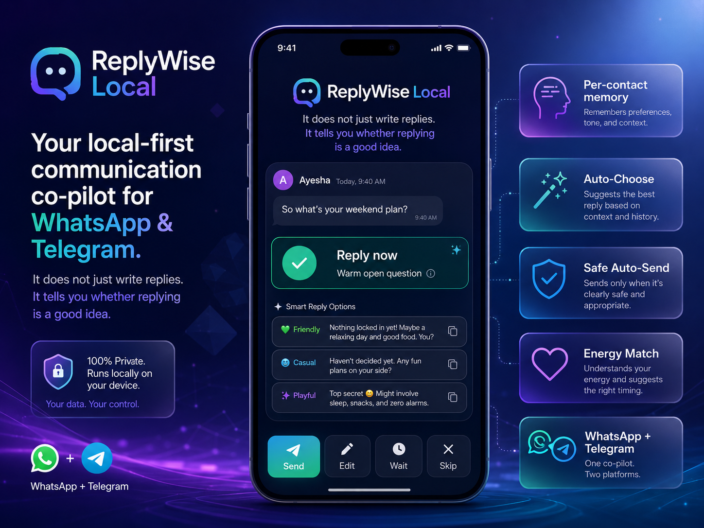
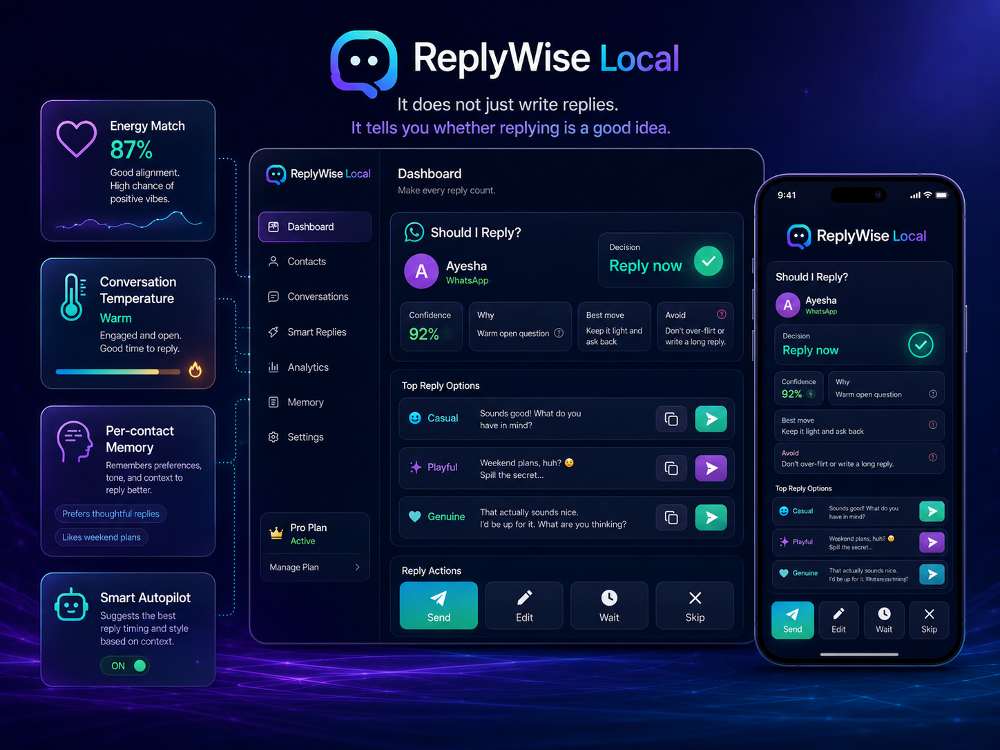
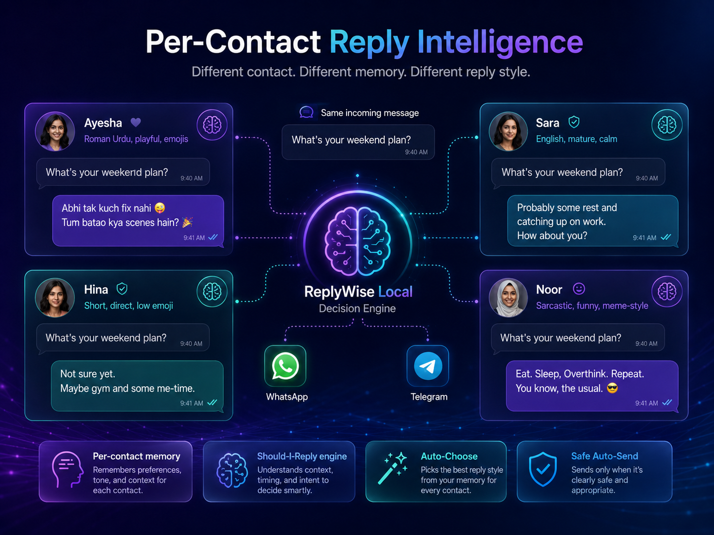

# ReplyWise Local

<p align="center">
  
</p>

**It does not just write replies. It tells you whether replying is a good idea.**

<p align="center">
  
</p>

ReplyWise Local is a local-first communication co-pilot for WhatsApp, Telegram, and experimental WeChat browser sessions. It watches incoming messages through browser/session agents, analyzes the conversation context, decides whether replying is actually a good idea, generates safe reply options, and sends only after manual approval.

The product is designed for **free-cost operation**:

- No official messaging API keys by default
- No bot tokens by default
- No paid cloud AI required
- No screenshot/OCR reading loop
- Browser-session agents only
- Local decision engine first
- Manual approval before every send

---

## Core Promise

Most AI tools only answer this:

> “What should I reply?”

ReplyWise Local answers the more important question first:

> “Should I reply at all?”

Every incoming message is analyzed for timing, tone, emotional state, energy balance, boundaries, and conversation momentum.

---

## MVP Channels

The MVP intentionally focuses on **two channels only**:

| Channel | Mode | Status |
|---|---|---|
| WhatsApp | `whatsapp-web.js` browser session | Primary MVP channel |
| Telegram | Playwright browser session | Secondary MVP channel |
| WeChat | Playwright browser session / WeChat Web | Experimental channel |

> WeChat support is included, but it should be treated as experimental until tested with your own WeChat Web session.

The product does **not** try to support every platform in v0.1. Reliability matters more than channel count.

---

## Key Features

### 1. Should-I-Reply Decision Engine

Each incoming message produces a structured decision:

```json
{
  "decision": "reply_now | wait | no_reply | repair | end",
  "confidence": 87,
  "reason": "They asked a warm open-ended question.",
  "best_move": "Answer lightly and ask back.",
  "avoid": "Do not over-flirt or write a long reply."
}
```

### 2. Reply Options

When replying is a good idea, ReplyWise generates three options:

- Casual
- Playful
- Genuine / repair / short, depending on context

Each option is designed to be natural, short, and consistent with the user's normal tone.

### 3. Manual Approval Only

ReplyWise never auto-sends by default.

```txt
Incoming message
↓
Analyze decision
↓
Generate reply options
↓
User approves, edits, waits, or skips
↓
Browser agent sends only after approval
```

### 4. Energy Matching

The system tracks whether you are over-investing compared to the other person.

Example:

```txt
Your average message length: 42 words
Their average message length: 8 words
Warning: you are writing 5x more.
Best move: keep the next reply short.
```

### 5. Conversation Temperature

Each contact gets a live state:

```txt
Cold
Neutral
Warm
Playful
Flirty
Deep
Tense
Paused
```

Reply suggestions are adapted to this state.

### 6. Anti-Cringe Filter

ReplyWise avoids replies that are:

- Too long
- Too needy
- Too poetic
- Too fake
- Too intense
- Too flirty too early
- Too AI-sounding

### 7. Local Memory

The system stores practical per-contact memory:

```txt
Facts:
- exams next week
- likes Roman Urdu
- prefers short replies when busy

Style:
- playful
- light emojis
- responds well to teasing

Boundaries:
- do not pressure during exams
- avoid heavy late-night topics

Inside jokes:
- Pepsi vs Cola
- fear of lizards
```

### 8. Free-Cost First

Default mode uses local rules and templates.

Optional AI modes can be added later:

| Mode | Cost | Privacy | Description |
|---|---:|---|---|
| Local rules | Free | Local | Default |
| Ollama | Free after setup | Local | Optional local LLM |
| Gemini / cloud AI | API-dependent | External | Optional user-provided key only |

---

## Architecture

<p align="center">
  
</p>

```txt
WhatsApp / Telegram / WeChat Web
        ↓
Browser Agent
        ↓
Incoming Message Ingest API
        ↓
Conversation Engine
        ↓
Should-I-Reply Decision
        ↓
Reply Generator
        ↓
Mobile Approval Dashboard
        ↓
Outgoing Queue
        ↓
Browser Agent Sends Through Web UI
```

---

## Project Structure

```txt
replywise-local/
├── src/
│   ├── server.js
│   ├── db/
│   │   ├── index.js
│   │   └── seed.js
│   ├── ai/
│   │   ├── index.js
│   │   ├── local-decision-engine.js
│   │   ├── local-template-engine.js
│   │   └── ollama-client.js
│   ├── safety/
│   │   └── guardrails.js
│   ├── bridge/
│   │   ├── base-agent.js
│   │   ├── whatsapp-agent.js
│   │   ├── telegram-agent.js
│   │   ├── wechat-agent.js
│   │   └── agent-manager.js
│   └── ui/
│       └── templates.js
├── data/
│   ├── sessions/
│   └── screenshots/
├── scripts/
├── .env.example
├── package.json
└── README.md
```

---

## Requirements

- Node.js 20+
- npm
- A WhatsApp account for WhatsApp Web login
- A Telegram account for Telegram Web login
- A WeChat account for WeChat Web QR login, if you enable the experimental WeChat agent
- Chromium dependencies for Playwright / Puppeteer

No official WhatsApp Cloud API key is required.

No Telegram Bot API token is required for the browser-agent mode.

No WeChat Official Account token, app secret, or developer API key is required for the experimental browser-agent mode.

---

## Quick Start

### 1. Install

```bash
git clone https://github.com/YOUR_USERNAME/replywise-local.git
cd replywise-local
npm install
```

### 2. Configure

```bash
cp .env.example .env
```

Recommended free-cost settings:

```env
PORT=3000
APP_BASE_URL=http://localhost:3000

AI_PROVIDER=local
ALLOW_AUTOSEND=false

ENABLED_AGENTS=whatsapp
# Optional: whatsapp,telegram,wechat
BROWSER_HEADLESS=false

SCREENSHOT_ON_ERROR=false
LIVE_SCREENSHOT=false
OCR_ENABLED=false

BRIDGE_POLL_MS=5000
HEALTH_CHECK_INTERVAL=60
```

### 3. Reset and seed database

```bash
npm run reset
npm run seed
```

### 4. Start the dashboard

```bash
npm run dev
```

Open:

```txt
http://localhost:3000
```

### 5. Start browser agents

Run WhatsApp only:

```bash
npm run agent:whatsapp
```

Run Telegram only:

```bash
npm run agent:telegram
```

Run WeChat only:

```bash
npm run agent:wechat
```

Run WhatsApp + Telegram + WeChat:

```bash
npm run agent:all
```

Run all enabled agents:

```bash
npm run agents
```

---

## Recommended v0.1 Test Flow

Start with one channel and one test contact. Use WhatsApp first. Test WeChat later because it depends on WeChat Web availability for your account.

```txt
1. Start dashboard
2. Start WhatsApp agent
3. Scan WhatsApp Web QR code
4. Ask a test contact to message you
5. Confirm the incoming message appears in dashboard
6. Review the should-reply decision
7. Approve or edit a reply
8. Confirm the browser agent sends it
9. Confirm outgoing status becomes sent
```

Success means:

- Incoming message detected
- Decision created
- Reply options shown
- Manual approval required
- Outgoing message queued
- Browser agent sends through web UI
- No screenshot/OCR used

---

## Environment Variables

| Variable | Default | Description |
|---|---|---|
| `PORT` | `3000` | Dashboard/API port |
| `APP_BASE_URL` | `http://localhost:3000` | Orchestrator URL used by agents |
| `AI_PROVIDER` | `local` | `local` or optional `ollama` |
| `ALLOW_AUTOSEND` | `false` | Must stay false for safety |
| `ENABLED_AGENTS` | `whatsapp` | Comma-separated agent list, e.g. `whatsapp,telegram,wechat` |
| `BROWSER_HEADLESS` | `false` | Set true after login is stable |
| `SESSION_DIR` | `./data/sessions` | Persistent browser session folder |
| `SCREENSHOT_ON_ERROR` | `false` | Emergency debugging only |
| `LIVE_SCREENSHOT` | `false` | Keep off in free-cost mode |
| `OCR_ENABLED` | `false` | Keep off; not needed for normal reading |
| `BRIDGE_POLL_MS` | `5000` | Outgoing queue polling interval |
| `HEALTH_CHECK_INTERVAL` | `60` | Agent health interval in seconds |

---

## Dashboard Actions

For every incoming message, the dashboard should show:

```txt
Contact · Channel
Incoming message

Decision:
Reply now / Wait / No reply / Repair / End

Why:
Short explanation

Best move:
What to do next

Avoid:
What not to do

Reply options:
1. Casual
2. Playful
3. Genuine / repair

Actions:
Send
Edit
Wait
Skip
```

---

## Safety Principles

ReplyWise is a human-in-the-loop communication assistant.

It should not be used for:

- Spam
- Harassment
- Manipulation
- Impersonation
- Fully autonomous messaging
- Bypassing platform enforcement
- Sending messages without human review

Hard rules:

```txt
No auto-send by default.
No stealth/bypass logic.
No screenshot reading loop.
No OCR-based message reading.
No official API-key dependency for MVP, including no WeChat Official Account API key for browser-agent mode.
No reply after clear rejection or boundary.
```

---

## Platform Risk Notice

Browser automation may violate the terms of service of some platforms. Sessions can break, selectors can change, and accounts may face restrictions.

Use this project for personal experimentation and local prototyping only. Prefer read-only mode during testing. Use a secondary account where appropriate.

---

## Why Not Many Channels?

The v0.1 goal is not to support every messaging app. WeChat is included as an experimental browser-agent channel, but WhatsApp should remain the primary proof channel.

The v0.1 goal is:

```txt
One or two stable channels, with WeChat available as experimental.
Free-cost.
Reliable.
Manual approval.
Good judgment.
No bad replies.
```

Additional platforms can be added later after the core product is proven.

---

## Roadmap

### v0.1 — WhatsApp Proof

- WhatsApp browser/session agent
- Local dashboard
- Should-I-reply engine
- Manual approval
- Local templates
- Energy matching
- Anti-cringe filter

### v0.2 — Telegram

- Telegram Web browser agent
- WebSocket + DOM watcher
- Same approval flow
- Same memory system

### v0.2.5 — Experimental WeChat

- WeChat Web browser agent
- QR login through WeChat Web
- DOM-based message watcher
- Same per-contact memory and approval flow
- Treat as experimental because WeChat Web availability and selectors may vary by account/region

### v0.3 — Better Intelligence

- Contact-specific rules
- Conversation temperature graph
- Reply feedback learning
- Repair mode
- Do-not-reply engine improvements

### v0.4 — Local Desktop App

- Electron wrapper
- Local encrypted database
- One-command startup
- Mobile-friendly local web UI

### v0.5 — Optional Smart Mode

- Ollama integration
- User-provided Gemini key option
- Strict budget manager
- Local fallback when quota ends

---

## Development Scripts

Common scripts:

```bash
npm run dev
npm run reset
npm run seed
npm run agents
npm run agent:whatsapp
npm run agent:telegram
npm run agent:wechat
npm run agent:all
npm test
```

---

## Example Decision Card

```txt
Ayesha · WhatsApp

"So what's your weekend plan?"

Decision:
✅ Reply now

Why:
She asked an open question and the tone is warm.

Best move:
Keep it light and ask back.

Avoid:
Do not over-flirt or write a long message.

Option 1:
"Nothing fixed yet, maybe food and rest. Tumhara kya scene hai?"

Option 2:
"Plan toh pending hai, agar koi acha idea mil gaya toh weekend bach jayega 😂"

Option 3:
"Weekend depends on company tbh 😄 tumhara kya plan?"

[Send] [Edit] [Wait] [Skip]
```

---

## Contributing

Contributions should follow the product principle:

> Reliability and judgment are more important than channel count.

Before adding a new platform, improve:

- WhatsApp reliability
- Telegram reliability
- WeChat experimental reliability
- Decision quality
- Local memory
- Safety rules
- Mobile dashboard UX

---

## License

MIT License.

---

## Disclaimer

ReplyWise Local is an experimental local-first assistant. It is not affiliated with WhatsApp, Telegram, WeChat, Meta, Tencent, or any messaging platform. Use responsibly, respect privacy, and always remain the author of your own messages.
